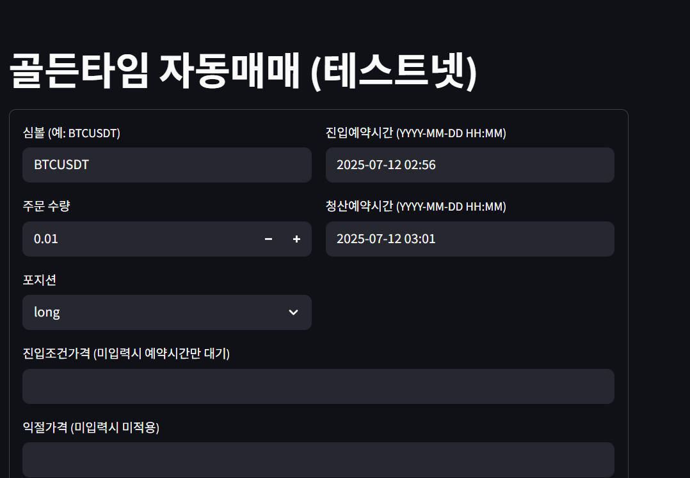

-------------
1. 모든 입력창은 직접 입력이 아닌, 선택방식으로 수정하기 
2. 골든타임자동매매의 궁극적인 목표는 골든타임감시봇에서 받아오는 시간별 변동성값, 롱숏승률, 요일 데이터로 자동매매하는것
3. 예약시간은 곧 매일 이시간에 매수매도가 이루어진다는 뜻. 하루에 최대 2회 매매가 가능하게 입력창을 2쌍(매수매도) 만들어야함. 
4. 주문수량은 고정손실을 계산하는 로직추가해서 레버리지관계없이 손실을 고정. 그러려면 손실값을 먼저정해야함.
5. 진입조건 가격은 삭제 
6. 포지션 조건 추가: 1시간봉 200이평선 위로는 롱, 아래로는 숏 => 궁극적으로는 골든타임감시봇에서 받아오는 롱숏승률 연계. 선택권을 주자. 이평선조건 감시봇 조건
7.  손절가격 7이평선 최저값 또는 최고값 단 너무 거리가 짧거나, 0.2%보다 길때는 다른 최저점찾거나, 0.2%로 고정, 직전캔들의 고점보다 더 높은 고점+5틱 
8. 익절값은 손절의 2배, 3배 
9. 사이트 디자인은 사용자 친화적이면서 세련되고 깔끔하게
10. 그밖에 유틸리티1: 골든타임감시봇을 연동시키자
11. 유틸리티2: 레퍼럴연결시킬만한거 없을까...사이트에 골든타임매매기록과 공지매매기록을 남기기. 나한테 뭐가 좋냐??흠...레퍼럴유도? 내 신뢰 상승? 
12. 로그인기능넣고 수익률 순위 매기기 
13. 각종봇 활용꿀팁 가이드 추가 
14. 펀딩비 매매 , 김프매매 추가???
15. 밈코인 분석툴 추가 
16. 통합플랫폼으로 발전시키기(이름정하기 포비트)
17. 트레이딩뷰 지표 추가 하고 트뷰 레퍼럴 링크 연결. 
18. 트뷰 자동매매 봇 
19. 트뷰 차트 연결 
20. 한김에 김프사이트추가하자 
21. 공지매매 꼭추가.상장 상폐 거래유의 등등 
22. 상단메뉴만들기 
23. 예약매수시간에 바로들어가는게 아니라, 진입조건 충족하면 들어가는 로직도 옵션으로? 예를들어 호가창속도가 빨라지거나, 5분봉기준으로 윗꼬리패턴3번나오거나 등등